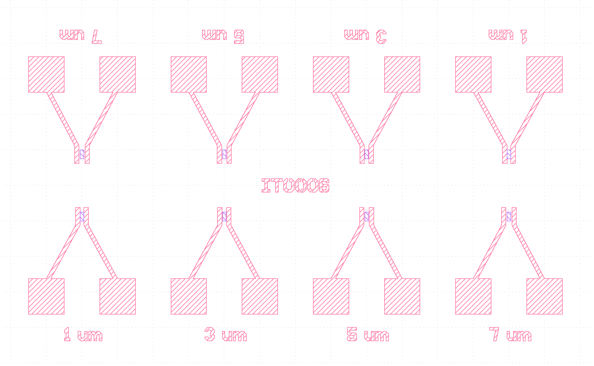
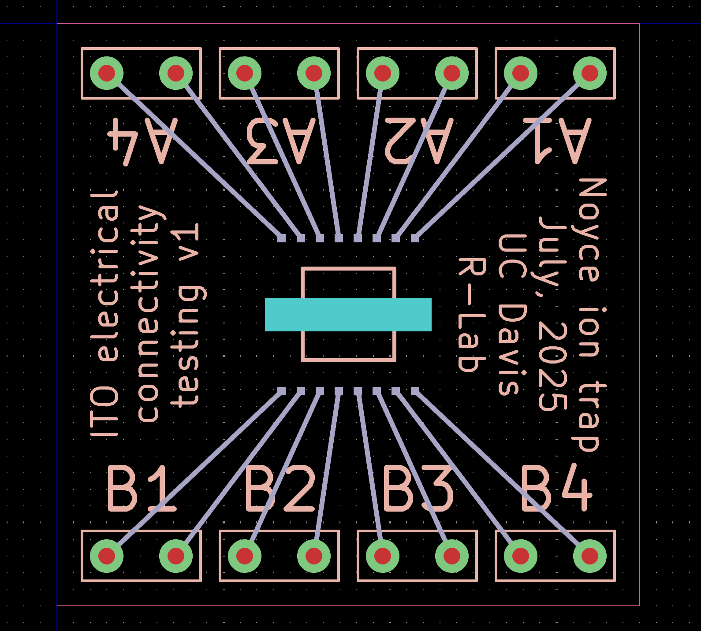

# electrode-array-layout

This code generates GDS files for arrays two-electrode devices with wirebond pads, and PCB (gerber) files for a corresponding PCB which the chip can be mounted and wirebonded to, to connect it out to measurement equipment.
I've made one-off chips like this a number of times, so I decided to systematize the code a bit and publish it in case anyone else can make use of it.
This type of design can be good for measuring electrical resistivity of some substance deposited across the electrodes, or to apply an electric field to the substrate below.
It's a bit messy! I offer this mostly as a starting point for others to modify into something that suits their needs.

It uses `GDSFactory` for GDS generation, and `pcbnew` for gerber file generation (note that `pcbnew` is internal to KiCad; you will need to install KiCad to use it).

Example GDS as seen in KLayout:

Example PCB as seen in KiCad:

## Sponsorship - [PCBWay](https://www.pcbway.com/)

This project was sponsored by PCBWay.
Overall I've been very satisfied with the quality of the PCBs made by PCBWay.
The quality of their boards is very high, and their pricing is accessible for prototyping in small batches.
I am very pleased to get this project sponsored by PCBWay and can recommend their service, especially for the high quality you get and the huge amount of configurable settings.
